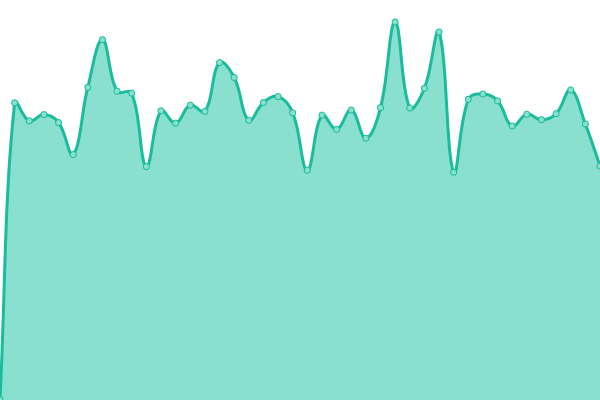

# [📈 Live Status](https://status.dariox.club): <!--live status--> **🟩 All systems operational**

This repository contains the open-source uptime monitor and status page for [dariox](http://dariox.club), powered by [Upptime](https://github.com/upptime/upptime).

With [Upptime](https://upptime.js.org), you can get your own unlimited and free uptime monitor and status page, powered entirely by a GitHub repository. We use [Issues](https://github.com/darioxmastodon/status/issues) as incident reports, [Actions](https://github.com/darioxmastodon/status/actions) as uptime monitors, and [Pages](https://status.dariox.club) for the status page.

<!--start: status pages-->
<!-- This summary is generated by Upptime (https://github.com/upptime/upptime) -->
<!-- Do not edit this manually, your changes will be overwritten -->
<!-- prettier-ignore -->
| URL | Status | History | Response Time | Uptime |
| --- | ------ | ------- | ------------- | ------ |
|  [Mastodon](https://dariox.club) | 🟩 Up | [mastodon.yml](https://github.com/darioxmastodon/status/commits/HEAD/history/mastodon.yml) | 

 1072ms
     
 | 

<a href="https://status.dariox.club/history/mastodon">100.00%</a>
    

|  [Email](email-smtp.ap-southeast-2.amazonaws.com) | 🟩 Up | [email.yml](https://github.com/darioxmastodon/status/commits/HEAD/history/email.yml) | 

 187ms
     
 | 

<a href="https://status.dariox.club/history/email">100.00%</a>
    

|  [Relay](https://relay.dariox.club) | 🟩 Up | [relay.yml](https://github.com/darioxmastodon/status/commits/HEAD/history/relay.yml) | 

 1006ms
     
 | 

<a href="https://status.dariox.club/history/relay">97.24%</a>
    

|  [FediFinder](https://finder.dariox.club) | 🟩 Up | [fedi-finder.yml](https://github.com/darioxmastodon/status/commits/HEAD/history/fedi-finder.yml) | 

 1169ms
     
 | 

<a href="https://status.dariox.club/history/fedi-finder">100.00%</a>
    

|  [Media](http://d2xtlv1sdg7gxk.cloudfront.net) | 🟩 Up | [media.yml](https://github.com/darioxmastodon/status/commits/HEAD/history/media.yml) | 

 472ms
     
 | 

<a href="https://status.dariox.club/history/media">100.00%</a>
    

<!--end: status pages-->

[**Visit our status website →**](https://status.dariox.club)

## 📄 License

- Powered by: [Upptime](https://github.com/upptime/upptime)
- Code: [MIT](./LICENSE) © [dariox](http://dariox.club)
- Data in the `./history` directory: [Open Database License](https://opendatacommons.org/licenses/odbl/1-0/)
